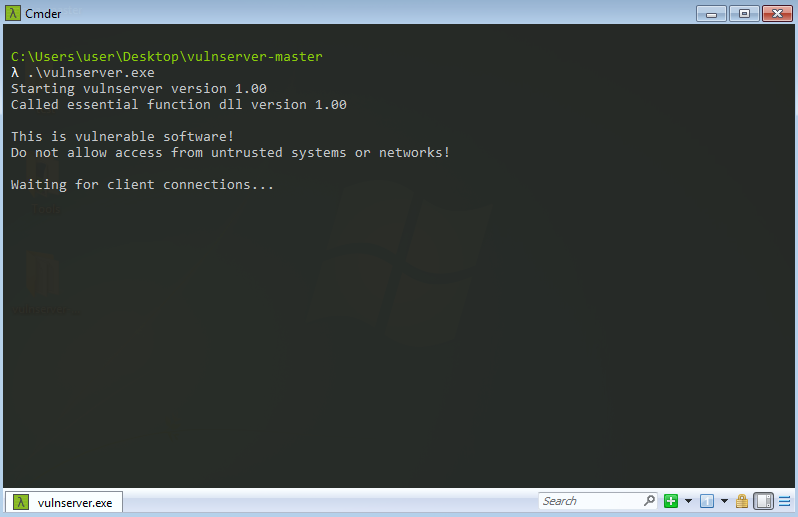

# VulnServer for Beginners Buffer Overflow Python and Reverse Shell Exploitation
VulnServer is a great tool for beginners who want to learn how to find buffer overflow vulnerabilities and develop exploit scripts using Python. This guide will walk you through the basics of stack-based buffer overflow and show you how to create a reverse shell exploit step by step.


## What You Will Learn

In this documentation, you will learn how to:  

- Use spiking to identify the vulnerable command in the program  
- Find the correct offset to overwrite the EIP (Instruction Pointer)  
- Detect and eliminate bad characters that may interfere with shellcode execution  
- Use `mona.py` to locate modules with the necessary assembly instructions  
- Develop an exploit script to inject shellcode  
- Generate and execute a reverse TCP shell using `msfvenom`  

This guide is beginner-friendly and includes step-by-step explanations with Python scripting and reverse shell execution.  

## About VulnServer  

[VulnServer](https://github.com/stephenbradshaw/vulnserver) is a Windows-based multithreaded TCP server that listens for client connections on port **9999** (by default). It includes multiple commands, some of which are intentionally vulnerable to buffer overflow attacks.  

### Why Use VulnServer?  
- It is designed for learning **buffer overflow exploitation** in a controlled environment.  
- Each vulnerability requires a slightly different approach to exploit, helping improve your skills.  
- Though it mimics a basic server, it has no real-world functionality beyond being a **safe target for testing exploits**.  
- This tool is ideal for those wanting to **learn, test, and practice buffer overflow attacks** in a safe way. 🚀


## Setting Up the Environment  

Before we start analyzing **VulnServer**, we need to set up our environment.  

### Machines Used:  
- **Target Machine (Victim):** Windows 7 x86 Starter Edition (running VulnServer on port **9999**)  
- **Attacker Machine:** Kali Linux (used to find and exploit the vulnerability)  

### Steps:  
1. Run **VulnServer** on the **Windows machine** and make sure it is listening on port **9999**.  
2. Use the **Kali Linux machine** to test and exploit the vulnerability.  




## Connecting to VulnServer  
Now, switch to your **Kali Linux** (or any other preferred penetration testing OS) and try to connect to the **VulnServer** running on port **9999** using **Netcat**:  

```bash
nc -v 10.0.2.15 9999
```


